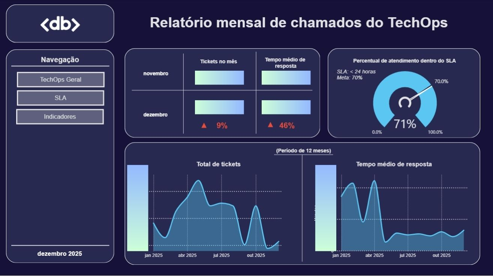
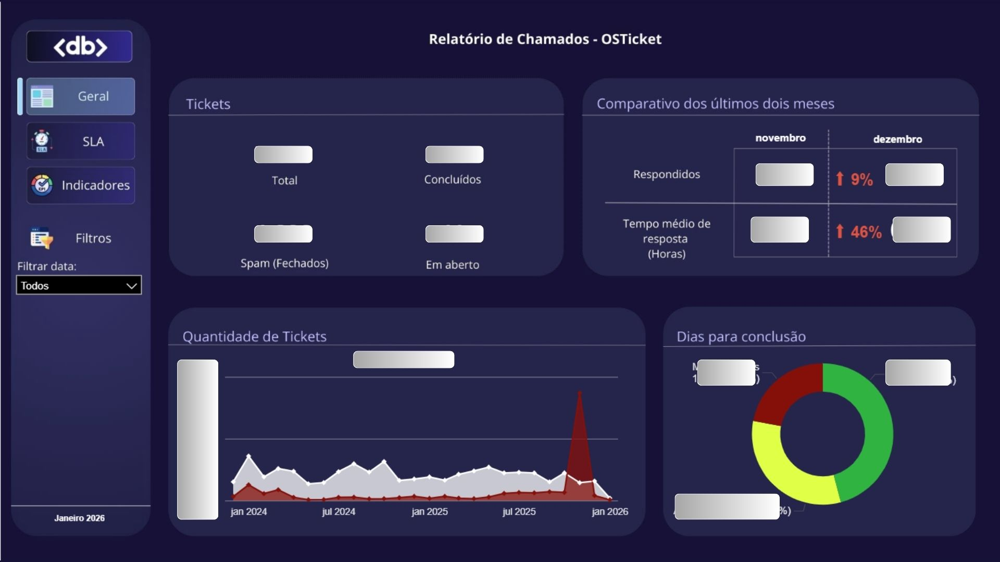
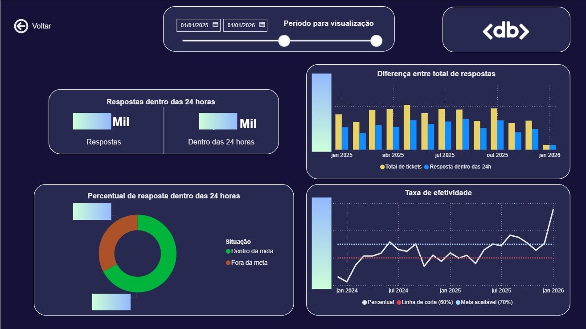
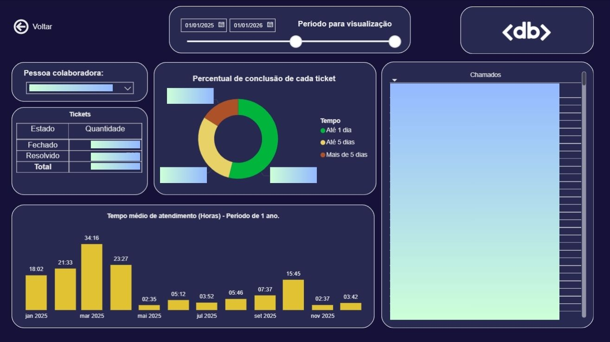

## 📊 Camada Gold e Métricas Analíticas

A camada Gold consolida os dados tratados, disponibilizando tabelas prontas para análise e visualização em ferramentas de BI.

As métricas são estruturadas tanto em nível de equipe quanto em nível individual.

### Principais métricas geradas:

- Total de tickets recebidos por período
- Total de tickets concluídos, fechados e em aberto
- Tempo de resposta e tempo de conclusão dos tickets
- Classificação dos tickets por faixa de tempo de fechamento:
  -  Até 1 dia
  -  Até 5 dias
  -  Mais de 5 dias
  -  Spam (não contabilizado)

- Indicadores de SLA
- KPIs

Essas métricas são utilizadas para acompanhamento de performance, identificação de gargalos e suporte à tomada de decisão do gestor.

####📈 Dashboards e Visualizações

Os dados da camada Gold são consumidos em dashboards interativos, desenvolvidos para apoiar a tomada de decisão do gestor e o acompanhamento da performance operacional do time.

Os dashboards permitem análises tanto em nível geral (equipe) quanto em nível individual (por atendente).

