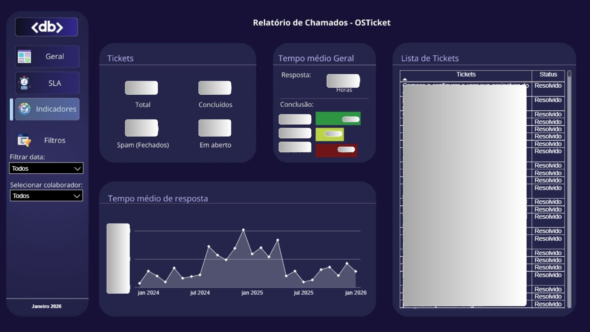

## 📊 Camada Gold e Métricas Analíticas

As métricas são estruturadas tanto em nível de **equipe** quanto em nível **individual**.

### Principais métricas geradas

- Total de tickets recebidos por período
- Total de tickets concluídos, fechados e em aberto
- Tempo médio de resposta e tempo médio de conclusão dos tickets
- Classificação dos tickets por faixa de tempo de fechamento:
  - Até 1 dia
  - Até 5 dias
  - Mais de 5 dias
  - Spam (não contabilizado)
- SLA
- KPIs 

Essas métricas são utilizadas para acompanhamento de performance e visibilidade das tarefas de cada membro do time.

---

## 📈 Dashboards e Visualizações

### Visão Geral

Nesta tela, é possível visualizar a quantidade de tickets, o tempo médio para conclusão, um comparativo entre os dois últimos meses e o percentual de aumento ou diminuição desses valores.

A seguir, um demonstrativo da tela:

---

### SLA

Nesta tela, são apresentados os indicadores relacionados ao cumprimento de SLA, incluindo:

- Total de respostas dentro do SLA
- Indicador de performance da equipe no último mês
- Taxa de SLA cumprido
- Comparativo entre os últimos 6 meses

A seguir, um demonstrativo da tela:

---

### Indicadores por Equipe e Colaborador

Nesta tela, é possível visualizar tanto as informações do time completo quanto de cada colaborador individualmente, incluindo:

- Quantidade de tickets
- Tempo médio geral
- Lista de tickets
- Tempo médio de resposta

A seguir, um demonstrativo da tela:

---

⚠️ **Aviso sobre confidencialidade**

Por se tratar de um projeto interno que utiliza dados sensíveis, as informações exibidas nas imagens foram anonimizadas e/ou mascaradas.  
As visualizações têm como objetivo demonstrar a estrutura do pipeline, as métricas geradas e a lógica analítica, sem expor dados reais da operação.

